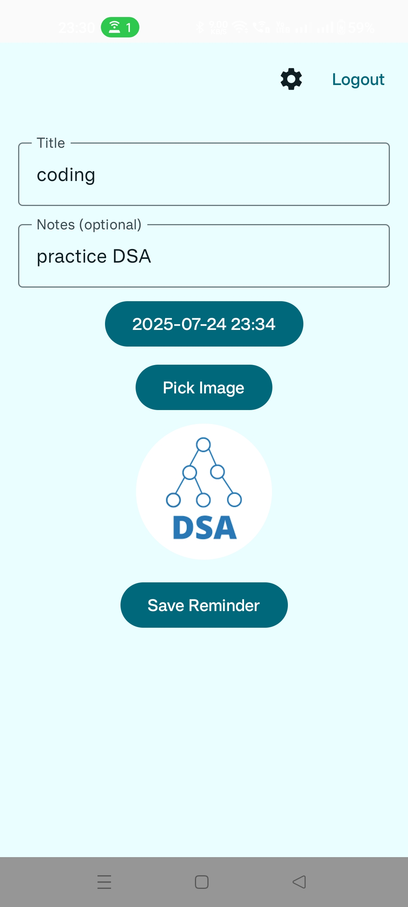
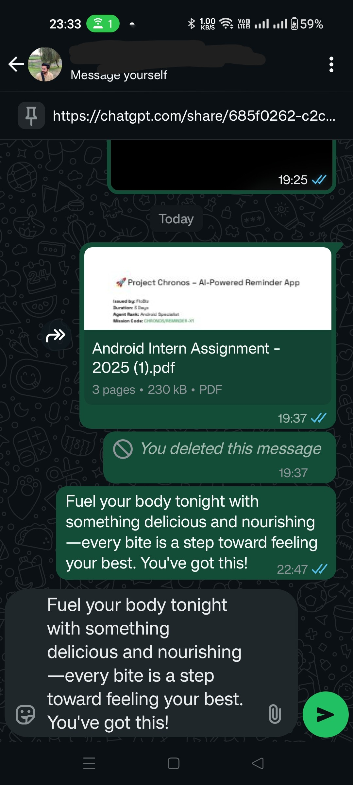

# Chronos – AI-Powered Reminder App

Chronos is a modern Android app that empowers you to schedule and manage reminders, enhanced with an AI co-pilot that delivers motivational or friendly greetings. Built with the latest Android technologies, Chronos is your thoughtful digital companion.

---

## 🎥 Demo 

_Click the image above to watch the 3-minute demo_

## ✨ Features

- **Google Sign-In**: Secure authentication with your Google account.
- **Reminders**: Add, edit, and delete reminders with title, date/time, notes, and an optional image.
- **Image Picker & Upload**: Attach images from your gallery or camera, uploaded to Cloudinary and displayed in the app.
- **Notifications**: Get timely local notifications for your reminders.
- **AI Greeting & Share**: Instantly generate and share motivational messages using an AI API.
- **Dynamic Theming**: Follows system light/dark mode with a manual toggle.
- **Modern UI**: Built with Jetpack Compose (Material 3) for a beautiful, responsive experience.

---

## 🛠️ Tech Stack

- **UI**: Jetpack Compose (Material 3)
- **Architecture**: MVVM + Clean Architecture
- **Async**: Kotlin Coroutines + Flow
- **Auth**: Firebase Auth (Google Sign-In)
- **Database**: Firebase Firestore
- **Image Storage**: Cloudinary
- **Notifications**: WorkManager
- **Dependency Injection**: Hilt
- **Theming**: Dynamic light/dark mode

---

## 📸 Screenshots

|                        |                        |                        |
|------------------------|------------------------|------------------------|
|    |    |    |
|    |    |    |
|   |   |    |
|  |  |  |
|   |  | 

---

## 🤖 AI Greeting API

Using [Pollinations AI](https://text.pollinations.ai/).

---

> Chronos isn’t just a reminder app—it’s a thoughtful digital companion.

